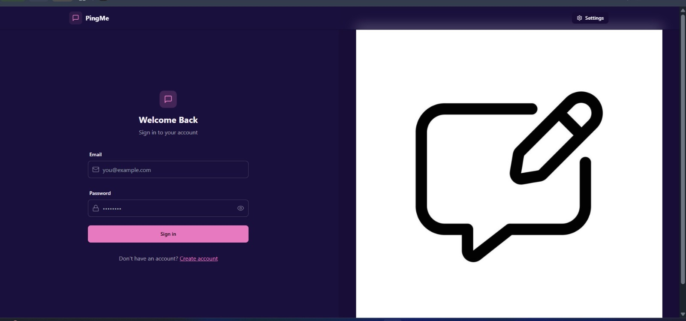
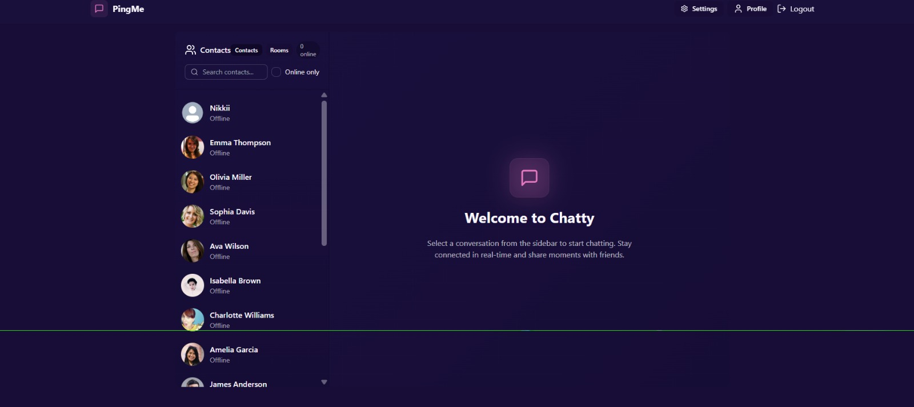
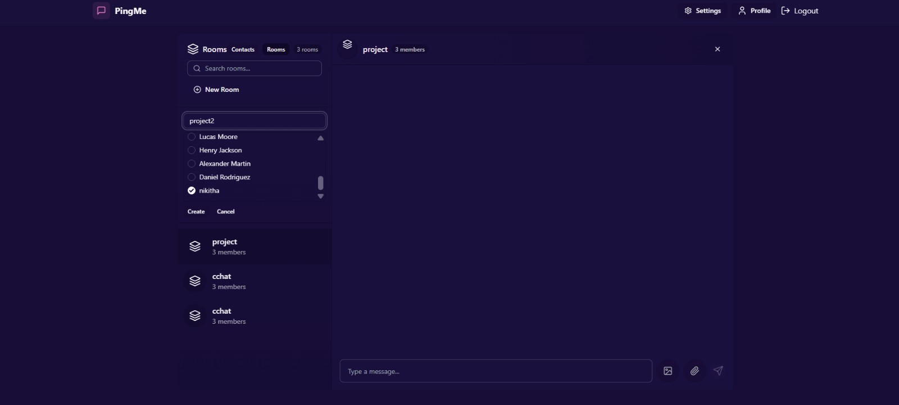
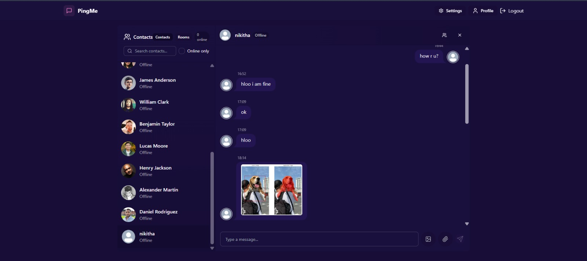
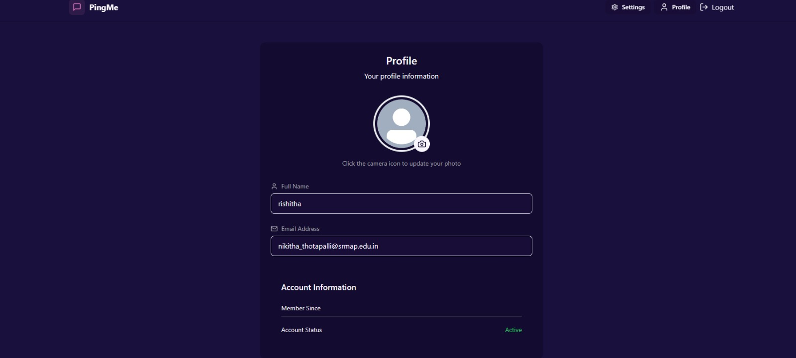

## 📸 Screenshots (Working Demo)

### 🔐 Login Page


### 🏠 Home — Contacts Dashboard


### 👥 Group Rooms — Create & Manage Rooms


### 💬 Real-time Chat — Text, Images & File Sharing


### 👤 User Profile — Update Name, Email & Avatar


# Fullstack Chat App (MERN + Socket.IO)

Real-time chat application built with the MERN stack and Socket.IO. It supports direct messages, group chat rooms, image uploads, and generic file attachments — all persisted in MongoDB. Authentication is handled via HTTP-only JWT cookies.


## Features

- Real-time messaging with `socket.io`
- Authentication with JWT (HTTP-only cookies)
- Direct messages between users
- Group chat rooms (create a room with just a name; you’re auto-added)
- Image uploads to Cloudinary
- Generic file attachments (stored as raw files on Cloudinary)
- Online presence indicator
- Responsive UI with Tailwind CSS

## Tech Stack

- Backend: `Node.js`, `Express`, `MongoDB`, `Mongoose`, `Socket.IO`, `Cloudinary`
- Frontend: `React`, `Vite`, `Zustand`, `Axios`, `Tailwind CSS`

## Project Structure

```
fullstack-chat-app/
├── backend/
│   └── src/
│       ├── controllers/        # API controllers
│       ├── lib/                # DB, Cloudinary, socket setup
│       ├── middleware/         # Auth middleware
│       ├── models/             # Mongoose schemas
│       ├── routes/             # Express routes
│       └── index.js            # Server entry
└── frontend/
    └── src/
        ├── components/
        ├── pages/
        ├── store/              # Zustand stores
        ├── lib/                # Axios instance
        └── App.jsx
```

## Prerequisites

- Node.js 18+
- A MongoDB connection string
- A Cloudinary account (for images and file attachments)

## Environment Variables (Backend)

Create a `.env` file in `backend/` with:

```
PORT=5001
MONGO_URI=your_mongodb_connection_string
JWT_SECRET=your_jwt_secret
CLOUDINARY_CLOUD_NAME=your_cloud_name
CLOUDINARY_API_KEY=your_api_key
CLOUDINARY_API_SECRET=your_api_secret
NODE_ENV=development
```

Notes:
- `NODE_ENV=development` ensures cookies are not marked `secure`, which is required for local HTTP.
- The backend reads `PORT` and will listen on `http://localhost:5001/` in development.

## Installation

From the repository root:

```
npm install --prefix backend
npm install --prefix frontend
```

## Run (Development)

Start the backend and frontend in two terminals (from the repo root):

```
npm run dev --prefix backend
npm run dev --prefix frontend
```

- Backend: `http://localhost:5001/`
- Frontend: Vite dev server — typically `http://localhost:5173/`.
  - If 5173 is taken, Vite will choose another port; check the terminal output for the actual URL.

Open the frontend URL to use the app.

## Authentication Flow

- Users must log in before accessing chat routes.
- Auth is enforced in the backend via `protectRoute` middleware.
- The frontend checks auth on app load and redirects to `Login` if unauthenticated.

## API Overview

Base URL: `http://localhost:5001/api`

- `POST /auth/signup` — Create account
- `POST /auth/login` — Log in
- `POST /auth/logout` — Log out
- `PUT /auth/update-profile` — Update profile (e.g., avatar)
- `GET /auth/check` — Check current user

Messages:
- `GET /messages/users` — Users list for sidebar
- `GET /messages/:id` — Direct conversation with user `:id`
- `POST /messages/send/:id` — Send direct message to user `:id` (supports `text`, `image`, `file`)

Rooms:
- `POST /rooms` — Create a room (requires `name`; auto-add creator)
- `GET /rooms` — Get rooms you belong to
- `GET /rooms/:id` — Get messages in room `:id`
- `POST /rooms/send/:id` — Send message to room `:id`

## File Uploads

- Images are uploaded to Cloudinary (`resource_type: image`).
- Generic file attachments use Cloudinary with `resource_type: raw`.
- The backend stores secure URLs in each `Message` document.

## Development Notes

- Frontend Axios base URL: `http://localhost:5001/api` in development, `/api` in production.
- Cookies use `sameSite: strict`; ensure frontend and backend run on `localhost` with development mode for cookies to work.
- Socket.IO server runs alongside the Express app and emits `getOnlineUsers` and `newMessage` events.

## Common Tasks

- Create a room: Go to `Rooms` → `New Room`, enter a name, click `Create` (members optional; you’re auto-added).
- Send a message: Select a user or a room, type a message, optionally attach an image or file, then send.

## Troubleshooting

- Backend port already in use: stop any existing server using port `5001`, then restart.
- Cookie/auth issues: confirm `NODE_ENV=development` in backend and that the frontend points to `http://localhost:5001/api`.
- Cloudinary errors: verify all Cloudinary env vars are set and the account is active.

## License

ISC — see `LICENSE`.
